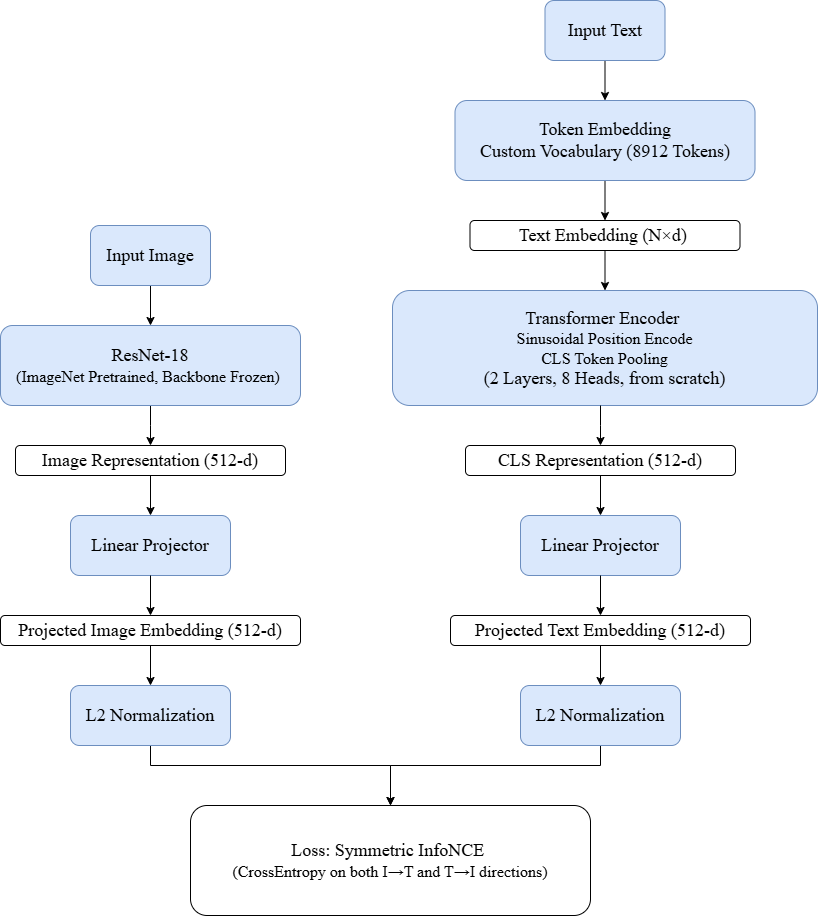

# Mini-CLIP: Image-Text Retrieval via Contrastive Learning

A from-scratch implementation of a CLIP-like dual-encoder model, trained on Flickr8k with multi-GPU DDP and WebDataset streaming pipeline.

Unlike standard toy projects, this repository focuses on scalable engineering practices, designed as a stepping stone toward Vision-Language-Action (VLA) research.

## Architecture



## Key Engineering Details

**Distributed Training**: PyTorch DDP with custom `GatherLayer` (`autograd.Function`) for differentiable `all_gather`, maximizing negative samples across GPUs.

**Streaming Data**: WebDataset (`.tar` shards) with `resampled=True` for infinite streaming, which is aimed to get prepared for future RLDS integration in VLA pipelines.

**Backbone Freezing**: ResNet backbone frozen (`requires_grad=False` + `eval()` mode for BatchNorm), preventing catastrophic forgetting from random text encoder gradients.

**Multi-Caption Handling**: Each `.tar` sample contains 1 image (.jpg) + 1 JSON list of 5 captions; `random.choice()` at read time ensures no duplicate images in a batch.

**Training Stability**: Data augmentation (RandomResizedCrop, ColorJitter, HorizontalFlip), Dropout (0.3), CosineAnnealingLR scheduler

## Result

**Dataset**: Flickr8k (8091 images total, 5 train shards / 3 val shards, ~5000 train samples and ~500 val samples per epoch via WebDataset resampling)

**Hardware**: 2x RTX 5090 via DDP on AutoDL

**Training**: 60 epochs, batch size 64, AdamW (lr=3e-4), CosineAnnealingLR

### Image-to-Text Retrieval (Recall@K)

| Recall@1 | Recall@5 | Recall@10 |
| -------- | -------- | --------- |
| 19.5%    | 46.5%    | 58.6%     |

### Inference Demo (Hard Negatives)

**Demo 1: In-Distribution (Flickr8k)**

Given a Flickr8k image of a brown dog running in a field:

| Rank | Score  | Caption                                        |
| ---- | ------ | ---------------------------------------------- |
| 1    | 0.9144 | A brown dog is running through a brown field . |
| 2    | 0.0764 | A dog running through a field                  |
| 3    | 0.0091 | A child running on a brown field               |
| 4    | 0.0001 | A dog sitting in the snow                      |
| 5    | 0.0000 | A cat sleeping on a couch                      |

**Demo 2: Out-of-Distribution (Lenna)**

Given the classic Lenna portrait (never seen during training):

| Rank | Score  | Caption                             |
| ---- | ------ | ----------------------------------- |
| 1    | 0.5405 | A woman without any hat             |
| 2    | 0.3360 | A woman wearing a hat with feathers |
| 3    | 0.1103 | A child looking over her shoulder   |
| 4    | 0.0080 | A man wearing a hat with feathers   |
| 5    | 0.0052 | A portrait of an elderly woman      |

## Project Structure

```text
src/
├── config.py       # All hyperparameters and paths in one place
├── vocab.py        # Custom vocabulary builder + text tokenizer
├── dataset.py      # WebDataset pipeline: decode → augment → tokenize → batch
├── model.py        # ImageEncoder (ResNet18) + TextEncoder (Transformer) + CLIP wrapper
├── loss.py         # InfoNCE with differentiable cross-GPU gather (GatherLayer)
├── engine.py       # train_one_epoch() + evaluate() with Recall@K computation
├── train.py        # DDP entry point: init → build loaders → train loop → save best
├── inference.py    # Load checkpoint → image-text similarity ranking
└── pack_wds.py     # Raw Flickr8k → WebDataset .tar shards (1 image + 5 captions JSON)
```

## Quick Start

### 1. Environment Setup

```bash
pip install -r requirements.txt
```

### 2. Data Preparation

We use the Flickr8k dataset for experiments

1. Download the dataset and place images in `data/flickr8k/Images` and `captions.txt` in `data/flickr8k`

2. Pack the dataset into WebDataset `.tar` shards
   
   ```bash
   python src/pack_wds.py
   ```

3. Vocabulary is built automatically when running `train.py` for the first time.

### 3. Training (Multi-GPU DDP)

```bash
torchrun --nproc_per_node=2 src/train.py
```

### 4. Inference

```bash
python src/inference.py
```

## Lessons Learned

This project surfaced several engineering challenges in multimodal contrastive learning:

1. Catastrophic Forgetting: A randomly initialized text encoder produces noisy gradients that can destroy pretrained vision encoder. 

Solution: freeze the backbone and only train projection heads and text encoder. Fine-tune the pretrained image encoder after it if needed.

2. BatchNorm in Frozen Backbones: To freeze a backbone, `requires_grad=False` is not sufficient and BatchNorm layers still update running statistics in `train()` mode which corrupts output features. 

Solution: call `backbone.eval()` and maintain it after `model.train()`.

3. DDP and WebDataset Deadlocks: When using `resampled=False` on a small validation set, uneven shard distribution across nodes causes one GPU to finish early, which causes deadlocking at `all_gather`. 

Solution: use `resampled=True` for both splits with explicit step counts.

4. `num_workers` > `num_shards`: WebDataset assigns shards to workers, so if workers is more than shards, empty workers crash with `ValueError: No samples found`. 

Solution: ensure `num_workers` is less than `num_tar_files/world_size`.

5. Validation Set Duplication in Streaming Pipelines: WebDataset with `resampled=True` draws samples with replacement. For training this is harmless for batch computing loss independently and discards it. But for Recall@K evaluation, all batch embeddings are concatenated into a single $N\times N$ similarity matrix. Duplicate images occupy top-K positions. Since the evaluation script treats them as incorrect, the Recall score is severely underestimated.

Solution: increase the number of validation shards relative to `VAL_SAMPLES` to minimize the duplication rate or use `resampled=False` with proper padding to avoid deadlocks.

## Roadmap

- [x] Dual-encoder CLIP architecture with InfoNCE loss

- [x] Multi-GPU DDP training with differentiable all_gather

- [x] WebDataset streaming pipeline

- [x] Backbone freezing and BatchNorm eval mode

- [x] Data augmentation, Dropout and CosineAnnealingLR

- [x] Recall@K evaluation (I2T)

- [x] Inference script with hard-negative testing

## References

- Radford et al., "Learning Transferable Visual Models From Natural Language Supervision" (CLIP), ICML 2021